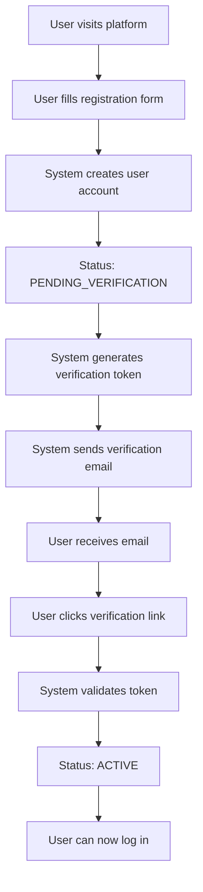
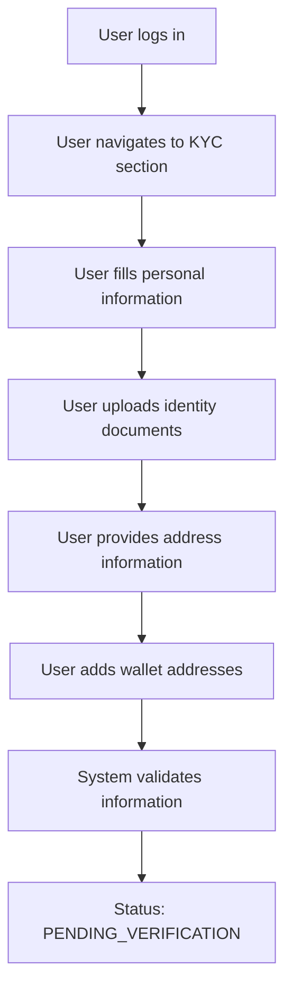
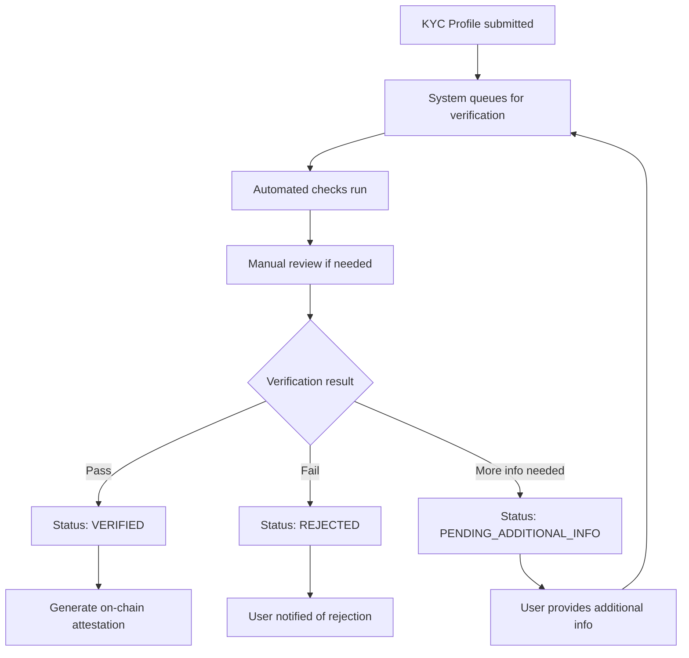
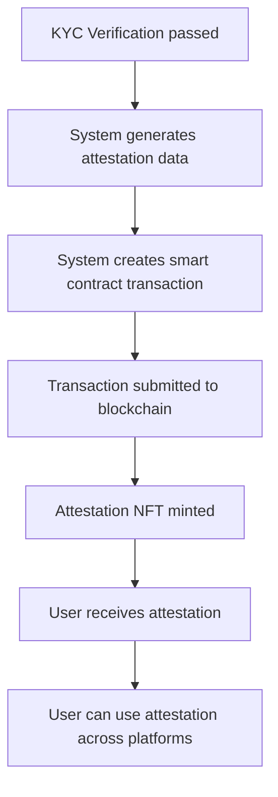
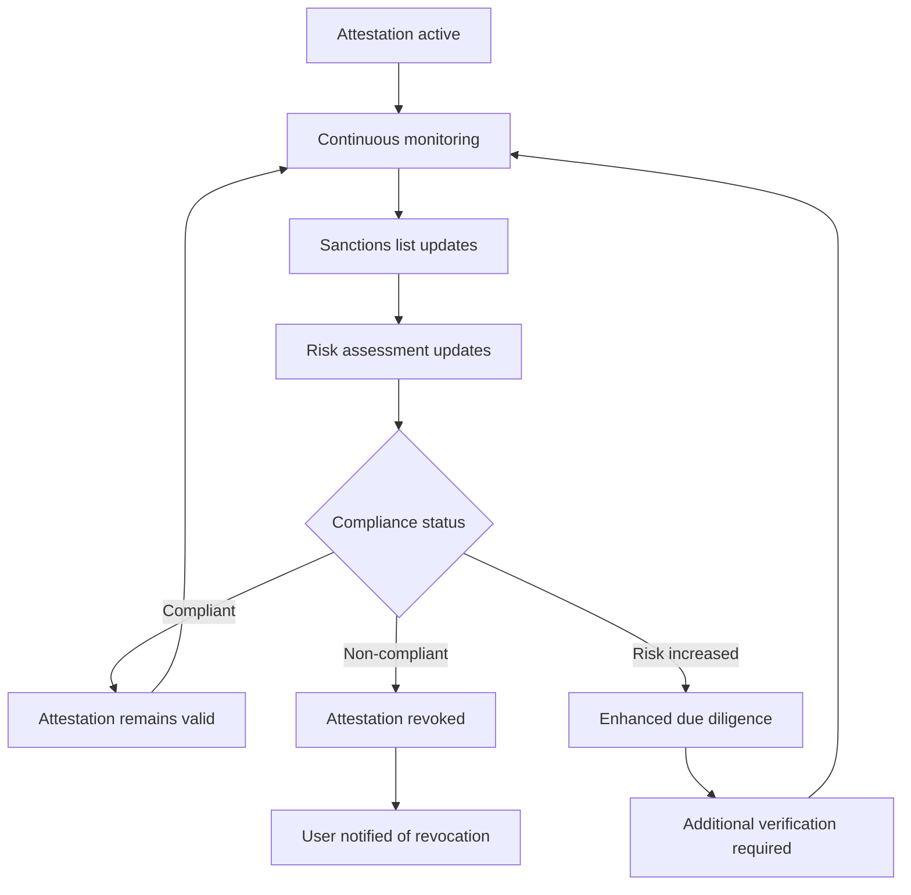

# KYC Attestation Platform - User Flow Documentation

## Overview

This document outlines the complete user journey through the KYC Attestation Platform, from initial registration to receiving on-chain attestations.

## User Journey Flow

### Phase 1: User Registration & Email Verification

**Key Points:**
- Email verification is mandatory before account activation
- Verification tokens expire after 24 hours
- Rate limiting prevents abuse (max 3 resend attempts per 24 hours)
- All attempts are logged for compliance

### Phase 2: KYC Profile Creation

**Required Information:**
- Personal details (name, date of birth, nationality)
- Identity documents (passport, driver's license, etc.)
- Address history (current and previous addresses)
- Wallet addresses for on-chain attestations
- Additional compliance information

### Phase 3: KYC Verification Process

**Verification Steps:**
1. **Document Validation**: Verify authenticity of uploaded documents
2. **Identity Verification**: Cross-reference with government databases
3. **Address Verification**: Validate address information
4. **Sanctions Screening**: Check against global sanctions lists
5. **Risk Assessment**: Evaluate overall risk profile
6. **Compliance Review**: Ensure regulatory requirements are met

### Phase 4: On-Chain Attestation

**Attestation Features:**
- **NFT Format**: Non-fungible token representing verified identity
- **Privacy-Preserving**: No PII stored on-chain, only cryptographic proofs
- **Interoperable**: Can be used across multiple token issuers
- **Revocable**: Can be revoked if compliance issues arise
- **Auditable**: All actions are recorded on-chain for transparency

### Phase 5: Ongoing Compliance & Monitoring

**Monitoring Activities:**
- **Real-time Sanctions Screening**: Continuous monitoring of global sanctions lists
- **Transaction Monitoring**: Analysis of wallet activity patterns
- **Risk Reassessment**: Periodic review of user risk profiles
- **Regulatory Updates**: Adaptation to changing compliance requirements

## Error Handling & Edge Cases

### Email Verification Issues
- **Token Expired**: User must request new verification email
- **Invalid Token**: System logs attempt and returns error
- **Rate Limit Exceeded**: User must wait 24 hours before retry

### KYC Verification Issues
- **Document Quality**: System requests better quality uploads
- **Missing Information**: User receives specific list of required items
- **Verification Failure**: Clear explanation of why verification failed
- **Appeal Process**: Users can appeal rejections with additional evidence

### Technical Issues
- **Blockchain Network Issues**: Fallback to traditional verification
- **System Outages**: Graceful degradation with status updates
- **Data Synchronization**: Real-time sync between on-chain and off-chain data

## Compliance & Audit Trail

### Data Retention
- **Verification Records**: Retained for regulatory compliance period
- **Audit Logs**: All actions logged with timestamps and user IDs
- **Transaction History**: Complete blockchain transaction history
- **Rate Limit Attempts**: All verification attempts logged

### Reporting
- **Compliance Reports**: Automated generation for regulatory bodies
- **Audit Reports**: Detailed logs for internal and external audits
- **Risk Assessments**: Regular risk profile updates
- **Incident Reports**: Documentation of any compliance issues

## Security Measures

### Data Protection
- **Encryption**: All sensitive data encrypted at rest and in transit
- **Access Control**: Role-based access to sensitive information
- **Audit Logging**: Complete trail of all data access and modifications
- **Data Minimization**: Only necessary data collected and stored

### Rate Limiting
- **IP-based Limits**: Prevents abuse from single sources
- **User-based Limits**: Prevents individual user abuse
- **Action-based Limits**: Different limits for different operations
- **Progressive Delays**: Increasing delays for repeated violations

## User Experience Considerations

### Accessibility
- **Multi-language Support**: Support for multiple languages
- **Mobile Optimization**: Responsive design for all devices
- **Clear Instructions**: Step-by-step guidance through complex processes
- **Progress Indicators**: Visual feedback on verification status

### Communication
- **Email Notifications**: Regular updates on verification progress
- **In-app Messages**: Real-time status updates
- **SMS Alerts**: Critical notifications via SMS
- **Support Integration**: Easy access to customer support

## Future Enhancements

### Advanced Features
- **Biometric Verification**: Fingerprint and facial recognition
- **Video Verification**: Real-time identity verification calls
- **Social Media Integration**: Additional identity verification sources
- **AI-powered Risk Assessment**: Machine learning for risk evaluation

### Integration Capabilities
- **API Ecosystem**: Third-party integrations for enhanced verification
- **Webhook Support**: Real-time notifications to external systems
- **Custom Workflows**: Configurable verification processes
- **Multi-tenant Support**: Client-specific customization options 