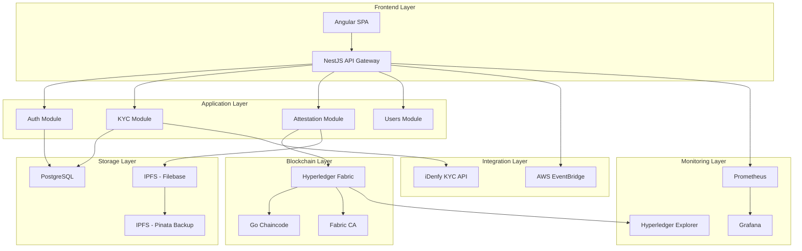

# Technical Specifications - KYC Attestation Platform

## Infrastructure Architecture Overview

This document provides detailed technical specifications for all infrastructure components based on the approved decisions.



## 1. Blockchain Infrastructure - Hyperledger Fabric

### Network Architecture
- **Consensus Algorithm**: Raft (CFT - Crash Fault Tolerant)
- **Channel Strategy**: One channel per client organization for isolation
- **Identity Management**: PKI-based with X.509 certificates
- **Deployment**: Docker containers with persistent volumes

### Node Configuration
```yaml
Orderer Nodes: 3-5 nodes (high availability)
Peer Nodes: 2 per organization (endorsement redundancy)
CA Nodes: 1 root CA + intermediate CAs per organization
```

### Chaincode Specifications
- **Language**: Go (primary)
- **Runtime**: Docker container execution
- **Endorsement Policy**: Majority of participating organizations
- **State Database**: CouchDB for complex queries

### Technical Details
```go
// Chaincode Interface
type AttestationContract interface {
    CreateAttestation(id, profileId, walletId, metadataUri string) error
    GetAttestation(id string) (*Attestation, error)
    RevokeAttestation(id string) error
    GetAllAttestations() ([]*Attestation, error)
    UpdateAttestationStatus(id, status string) error
}

// Attestation Data Structure
type Attestation struct {
    ID          string `json:"id"`
    ProfileID   string `json:"profileId"`
    WalletID    string `json:"walletId"`
    Status      string `json:"status"`
    MetadataURI string `json:"metadataUri"`
    IssuedAt    string `json:"issuedAt"`
    ExpiresAt   string `json:"expiresAt"`
    Issuer      string `json:"issuer"`
    RevokedAt   string `json:"revokedAt,omitempty"`
}
```

### Channel Configuration
```yaml
Channel Name: kycchannel
Participants:
  - KYC Platform Organization (endorser + orderer)
  - Client Organizations (endorsers)
Block Size: 500 transactions or 10MB
Block Timeout: 2 seconds
Endorsement Policy: "AND('KYCPlatformMSP.peer', 'ClientOrgMSP.peer')"
```

### Private Data Collections
```yaml
Collections:
  - Name: "complianceData"
    Policy: "OR('KYCPlatformMSP.member')"
    RequiredPeerCount: 1
    MaxPeerCount: 3
    BlockToLive: 1000
    MemberOnlyRead: true
    MemberOnlyWrite: true
```

---

## 2. Development Environment - Fabric Test Network

### Local Network Setup
- **Base**: Hyperledger Fabric test-network
- **Customization**: KYC-specific channel and chaincode
- **Docker Compose**: Orchestrated container deployment
- **Persistence**: Named volumes for blockchain data

### Directory Structure
```
fabric-network/
├── start-network.sh           # Network startup script
├── stop-network.sh            # Network cleanup script
├── organizations/             # Certificate and key material
│   ├── ordererOrganizations/
│   ├── peerOrganizations/
│   └── kycplatform/          # Platform-specific org
├── chaincode/
│   └── kyc-attestation/      # Go chaincode source
├── scripts/                  # Helper scripts
└── docker-compose-*.yml      # Container definitions
```

### Network Commands
```bash
# Start network with KYC channel
./start-network.sh

# Deploy attestation chaincode
./network.sh deployCC -ccn kycattestation -ccp ../chaincode/kyc-attestation -ccl go

# Test chaincode
peer chaincode invoke -C kycchannel -n kycattestation -c '{"function":"CreateAttestation","Args":["test1","profile1","wallet1","ipfs://hash"]}'
```

---

## 3. Certificate Authority - Self-Managed Fabric CA

### CA Hierarchy
```
Root CA (KYC Platform)
├── Intermediate CA (Client Org 1)
├── Intermediate CA (Client Org 2)
└── Intermediate CA (Client Org N)
```

### Certificate Lifecycle
1. **Bootstrap**: Root CA generates self-signed certificate
2. **Enrollment**: Organizations request intermediate CA certificates
3. **User Registration**: End users registered with organization CA
4. **Certificate Renewal**: Automated renewal before expiration
5. **Revocation**: Certificate revocation list (CRL) management

### Technical Configuration
```yaml
CA Server Config:
  Port: 7054
  Debug: false
  CRL Size Limit: 512000
  TLS:
    Enabled: true
    CertFile: ca-cert.pem
    KeyFile: ca-key.pem
  CA:
    Name: KYCPlatformCA
    KeyFile: ca-key.pem
    CertFile: ca-cert.pem
    ChainFile: ca-chain.pem
  Registry:
    MaxEnrollments: -1
    Identities:
      - Name: admin
        Pass: adminpw
        Type: client
        Affiliation: ""
        Attrs:
          hf.Registrar.Roles: "*"
          hf.Registrar.DelegateRoles: "*"
          hf.Revoker: true
          hf.IntermediateCA: true
          hf.GenCRL: true
```

---

## 4. Monitoring Stack - Hyperledger Explorer + Prometheus

### Hyperledger Explorer Configuration
- **Database**: PostgreSQL for explorer data
- **Network**: Connected to Fabric test network
- **Access**: Web UI on port 8080
- **Features**: Block explorer, transaction history, chaincode information

### Prometheus Metrics Collection
```yaml
Fabric Metrics:
  - fabric_peer_transaction_count
  - fabric_peer_block_commit_duration
  - fabric_orderer_consensus_normal_type
  - fabric_chaincode_execute_timeouts
  
Application Metrics:
  - kyc_verification_requests_total
  - attestation_creation_duration
  - api_request_duration_seconds
  - active_user_sessions
```

### Grafana Dashboards
1. **Fabric Network Health**
   - Block height per channel
   - Transaction throughput
   - Peer connectivity status
   - Orderer performance metrics

2. **Application Performance**
   - API response times
   - Database query performance
   - KYC verification success rates
   - Attestation creation metrics

3. **Business Intelligence**
   - Daily active users
   - KYC completion rates
   - Attestation status distribution
   - Regional usage patterns

### Alert Rules
```yaml
Alert Groups:
  - name: fabric_network
    rules:
      - alert: PeerDown
        expr: up{job="fabric-peers"} == 0
        for: 1m
        labels:
          severity: critical
        annotations:
          summary: "Fabric peer is down"
      
      - alert: HighTransactionLatency
        expr: fabric_peer_transaction_duration > 5
        for: 2m
        labels:
          severity: warning
        annotations:
          summary: "High transaction latency detected"
```

---

## 5. IPFS Storage - Filebase + Pinata

### Primary Storage - Filebase
```typescript
interface FilebaseConfig {
  endpoint: 'https://s3.filebase.com';
  accessKeyId: string;
  secretAccessKey: string;
  bucketName: 'kyc-attestations';
  region: 'us-east-1';
}

interface AttestationMetadata {
  attestationId: string;
  profileId: string;
  verificationLevel: 'basic' | 'enhanced' | 'premium';
  jurisdiction: string;
  verificationDate: string;
  expirationDate: string;
  documentHashes: string[];
  complianceFlags: string[];
}
```

### Backup Storage - Pinata
```typescript
interface PinataConfig {
  apiKey: string;
  secretApiKey: string;
  endpoint: 'https://api.pinata.cloud';
  gateway: 'https://gateway.pinata.cloud';
}

interface PinataMetadata {
  name: string;
  keyvalues: {
    attestationId: string;
    uploadTimestamp: string;
    backupSource: 'filebase';
  };
}
```

### Upload Strategy
1. **Primary Upload**: Filebase S3-compatible API
2. **Backup Upload**: Pinata JSON pinning API
3. **Verification**: Content hash verification across both services
4. **Retrieval**: Filebase first, fallback to Pinata
5. **Monitoring**: Track upload success rates and retrieval times

### Content Addressing
```
IPFS Hash Format: QmXXXXXXXXXXXXXXXXXXXXXXXXXXXXXXXXXXXXXXXXXXX
Content Path: /attestations/{year}/{month}/{attestationId}.json
Metadata Schema: JSON-LD with attestation vocabulary
```

---

## 6. API Gateway - NestJS Middleware

### Rate Limiting Configuration
```typescript
interface RateLimitConfig {
  windowMs: 15 * 60 * 1000;  // 15 minutes
  max: 100;                   // limit each IP to 100 requests per windowMs
  skipSuccessfulRequests: false;
  skipFailedRequests: false;
  keyGenerator: (req) => `${req.ip}:${req.user?.id || 'anonymous'}`;
}

interface SecurityMiddleware {
  helmet: boolean;           // Security headers
  cors: CorsOptions;        // CORS configuration
  compression: boolean;     // Response compression
  morgan: string;          // HTTP request logging
}
```

### API Versioning
```typescript
// Route structure
/api/v1/auth/*           // Authentication endpoints
/api/v1/users/*          // User management
/api/v1/kyc/*            // KYC verification
/api/v1/attestations/*   // Attestation management
/api/v1/monitoring/*     // Health and metrics

// Version headers
API-Version: 1.0.0
Accept-Version: ^1.0.0
```

### Error Handling
```typescript
interface ErrorResponse {
  success: false;
  error: {
    code: string;
    message: string;
    details?: any;
    timestamp: string;
    requestId: string;
  };
}

interface SuccessResponse<T> {
  success: true;
  data: T;
  meta?: {
    pagination?: PaginationMeta;
    version: string;
    timestamp: string;
  };
}
```

---

## 7. Event Streaming - AWS EventBridge

### Event Schema
```typescript
interface KYCEvent {
  source: 'kyc-attestation-platform';
  detailType: 'KYC Verification Status Changed' | 'Attestation Created' | 'Attestation Revoked';
  detail: {
    profileId: string;
    attestationId?: string;
    previousStatus?: string;
    newStatus: string;
    timestamp: string;
    metadata: Record<string, any>;
  };
}
```

### Event Bus Configuration
```yaml
EventBridge Bus: kyc-attestation-events
Region: us-east-1
Rules:
  - Name: KYCStatusChange
    Pattern:
      source: ["kyc-attestation-platform"]
      detail-type: ["KYC Verification Status Changed"]
    Targets:
      - Lambda: processKYCStatusChange
      - SQS: kycNotificationQueue
  
  - Name: AttestationEvents
    Pattern:
      source: ["kyc-attestation-platform"]
      detail-type: ["Attestation Created", "Attestation Revoked"]
    Targets:
      - Lambda: updateAttestationIndex
      - SNS: attestationNotifications
```

### Webhook Delivery
```typescript
interface WebhookConfig {
  endpoint: string;
  secret: string;
  retryPolicy: {
    maxRetries: 3;
    backoffMultiplier: 2;
    maxBackoffSeconds: 300;
  };
  timeout: 30000; // 30 seconds
  headers: {
    'Content-Type': 'application/json';
    'User-Agent': 'KYC-Platform-Webhook/1.0';
  };
}
```

---

## 8. Database Schema Integration

### Blockchain Integration Fields
```sql
-- Add blockchain-specific fields to existing schema
ALTER TABLE attestations ADD COLUMN blockchain_tx_id VARCHAR(255);
ALTER TABLE attestations ADD COLUMN blockchain_block_number BIGINT;
ALTER TABLE attestations ADD COLUMN fabric_channel_name VARCHAR(100) DEFAULT 'kycchannel';
ALTER TABLE attestations ADD COLUMN chaincode_name VARCHAR(100) DEFAULT 'kycattestation';

-- Create blockchain event log table
CREATE TABLE blockchain_events (
    id SERIAL PRIMARY KEY,
    event_type VARCHAR(50) NOT NULL,
    tx_id VARCHAR(255) NOT NULL,
    block_number BIGINT NOT NULL,
    channel_name VARCHAR(100) NOT NULL,
    chaincode_name VARCHAR(100) NOT NULL,
    event_data JSONB,
    created_at TIMESTAMP DEFAULT NOW()
);

-- Create IPFS metadata table
CREATE TABLE ipfs_metadata (
    id SERIAL PRIMARY KEY,
    attestation_id VARCHAR(255) NOT NULL REFERENCES attestations(id),
    primary_hash VARCHAR(255) NOT NULL,
    backup_hash VARCHAR(255),
    primary_provider VARCHAR(50) DEFAULT 'filebase',
    backup_provider VARCHAR(50) DEFAULT 'pinata',
    upload_status VARCHAR(20) DEFAULT 'pending',
    created_at TIMESTAMP DEFAULT NOW(),
    verified_at TIMESTAMP
);
```

---

## 9. Security Specifications

### Encryption Standards
- **Data at Rest**: AES-256 encryption for database
- **Data in Transit**: TLS 1.3 for all communications
- **Key Management**: AWS KMS integration for key rotation
- **Secrets**: AWS Secrets Manager for API keys and certificates

### Authentication Flow
```typescript
interface JWTPayload {
  sub: string;              // User ID
  email: string;
  role: UserRole;
  clientId: string;
  permissions: string[];
  iat: number;
  exp: number;
  jti: string;              // JWT ID for revocation
}

interface RefreshTokenPayload {
  sub: string;
  tokenFamily: string;      // For token rotation
  iat: number;
  exp: number;
}
```

### Authorization Matrix
```yaml
Roles:
  SUPER_ADMIN:
    - all:*
  CLIENT_ADMIN:
    - users:manage
    - attestations:manage
    - kyc:manage
    - reports:view
  CLIENT_USER:
    - attestations:view
    - kyc:submit
    - reports:view_own
```

---

## 10. Performance Specifications

### Response Time SLAs
- **API Endpoints**: < 200ms (95th percentile)
- **Blockchain Transactions**: < 5 seconds
- **KYC Verification**: < 30 seconds
- **Attestation Creation**: < 10 seconds
- **IPFS Upload**: < 5 seconds

### Throughput Requirements
- **Concurrent Users**: 1,000 simultaneous
- **API Requests**: 10,000 requests/minute
- **Blockchain TPS**: 1,000 transactions/second
- **Database Queries**: 5,000 queries/second

### Scalability Metrics
```yaml
Horizontal Scaling:
  - NestJS: Auto-scaling based on CPU/memory
  - Fabric Peers: Add peers per organization
  - Database: Read replicas for query scaling
  
Vertical Scaling:
  - API Servers: 4 vCPU, 8GB RAM baseline
  - Fabric Nodes: 8 vCPU, 16GB RAM baseline
  - Database: 16 vCPU, 32GB RAM baseline
```

---

## 11. Deployment Specifications

### Container Configuration
```dockerfile
# Example for NestJS backend
FROM node:20-alpine
WORKDIR /app
COPY package*.json ./
RUN npm ci --only=production
COPY dist ./dist
EXPOSE 3000
HEALTHCHECK --interval=30s --timeout=3s --start-period=5s --retries=3 \
  CMD curl -f http://localhost:3000/health || exit 1
CMD ["node", "dist/main"]
```

### Infrastructure as Code
```yaml
# AWS ECS Task Definition
TaskDefinition:
  Family: kyc-backend
  NetworkMode: awsvpc
  RequiresCompatibilities: [FARGATE]
  Cpu: 1024
  Memory: 2048
  ContainerDefinitions:
    - Name: kyc-backend
      Image: !Sub ${AWS::AccountId}.dkr.ecr.${AWS::Region}.amazonaws.com/kyc-backend:latest
      PortMappings:
        - ContainerPort: 3000
          Protocol: tcp
      LogConfiguration:
        LogDriver: awslogs
        Options:
          awslogs-group: /ecs/kyc-backend
          awslogs-region: !Ref AWS::Region
          awslogs-stream-prefix: ecs
```

This technical specification provides comprehensive implementation details for all approved infrastructure decisions and serves as the foundation for development work. 