# Stripe Billing Integration Guide

## Overview

The KYC Attestation Platform integrates with Stripe to provide subscription-based billing, self-service client onboarding, and automated payment management. This guide covers the complete implementation including API endpoints, webhook handling, and configuration.

---

## Table of Contents

1. [Architecture Overview](#architecture-overview)
2. [Environment Setup](#environment-setup)
3. [Stripe Dashboard Configuration](#stripe-dashboard-configuration)
4. [API Endpoints](#api-endpoints)
5. [Webhook Implementation](#webhook-implementation)
6. [Frontend Integration](#frontend-integration)
7. [Database Schema](#database-schema)
8. [Grace Period Management](#grace-period-management)
9. [Testing](#testing)
10. [Troubleshooting](#troubleshooting)

---

## Architecture Overview

```mermaid
graph TB
    subgraph "Frontend"
        A[Pricing Page] --> B[Stripe Checkout]
        C[Billing Page] --> D[Customer Portal]
        E[Dashboard] --> F[Warning Banner]
    end
    
    subgraph "Backend API"
        G[Billing Controller] --> H[Stripe Service]
        I[Webhook Controller] --> H
        H --> J[Database]
    end
    
    subgraph "Stripe Services"
        B --> K[Stripe Checkout Session]
        D --> L[Stripe Customer Portal]
        M[Stripe Webhooks] --> I
    end
    
    subgraph "Automation"
        N[Billing Scheduler] --> O[Grace Period Check]
        N --> P[Reminder Emails]
        O --> J
        P --> Q[Email Service]
    end
```



---

## Environment Setup

### Backend Configuration (`apps/backend/.env`)

```bash
# Stripe API Keys
STRIPE_SECRET_KEY="sk_test_..." # From Stripe Dashboard > Developers > API keys
STRIPE_WEBHOOK_SECRET="whsec_..." # From webhook endpoint configuration
STRIPE_PUBLISHABLE_KEY="pk_test_..." # For reference

# Additional required environment variables
DATABASE_URL="postgresql://..." # PostgreSQL connection string
JWT_SECRET="..." # For authentication
```

### Frontend Configuration (`apps/frontend/.env`)

```bash
# Stripe Configuration
VITE_STRIPE_PUBLISHABLE_KEY="pk_test_..." # Same as backend publishable key

# API Configuration
VITE_API_BASE_URL="http://localhost:3000/api" # Backend API URL
```

---

## Stripe Dashboard Configuration

### 1. Create Products and Prices

1. Go to **Products > Add product**
2. Create two products:

**Starter Plan:**
- Name: "Starter"
- Description: "Perfect for small token projects getting started with compliance"
- Pricing: $99/month (recurring)
- Copy the Price ID (e.g., `price_1234567890`)

**Professional Plan:**
- Name: "Professional" 
- Description: "Ideal for growing projects with advanced compliance needs"
- Pricing: $299/month (recurring)
- Copy the Price ID (e.g., `price_0987654321`)

3. Update the frontend pricing page with actual price IDs:

```typescript
// apps/frontend/src/pages/Pricing.tsx
const pricingPlans: PricingPlan[] = [
  {
    name: 'Starter',
    priceId: 'price_1234567890', // Replace with actual Stripe price ID
    // ...
  },
  {
    name: 'Professional',
    priceId: 'price_0987654321', // Replace with actual Stripe price ID
    // ...
  },
];
```

### 2. Configure Webhooks

1. Go to **Developers > Webhooks**
2. Click **"+ Add endpoint"**
3. Set endpoint URL:
   - Production: `https://your-domain.com/api/billing/stripe/webhook`
   - Development with ngrok: `https://your-ngrok-url.ngrok.io/api/billing/stripe/webhook`

4. Select these events:
   - `checkout.session.completed`
   - `invoice.payment_succeeded`
   - `invoice.payment_failed`
   - `customer.subscription.deleted`

5. Copy the **Signing secret** (starts with `whsec_`) to your environment variables

---

## API Endpoints

### Billing Management Endpoints

#### Create Checkout Session
```http
POST /api/billing/checkout-session
Authorization: Bearer {jwt_token}
Content-Type: application/json

{
  "priceId": "price_1234567890",
  "successUrl": "https://your-app.com/dashboard?subscription=success",
  "cancelUrl": "https://your-app.com/pricing?subscription=cancelled"
}
```

**Response:**
```json
{
  "sessionId": "cs_test_...",
  "url": "https://checkout.stripe.com/pay/cs_test_..."
}
```

#### Create Customer Portal Session
```http
POST /api/billing/customer-portal
Authorization: Bearer {jwt_token}
Content-Type: application/json

{
  "returnUrl": "https://your-app.com/billing"
}
```

**Response:**
```json
{
  "url": "https://billing.stripe.com/session/..."
}
```

#### Get Billing Status
```http
GET /api/billing/status
Authorization: Bearer {jwt_token}
```

**Response:**
```json
{
  "billingStatus": "ACTIVE",
  "subscriptionId": "sub_1234567890",
  "gracePeriodEndsAt": null,
  "lastPaymentFailedAt": null
}
```

### Webhook Endpoint

#### Stripe Webhook Handler
```http
POST /api/billing/stripe/webhook
Stripe-Signature: t=1234567890,v1=...
Content-Type: application/json

{
  "id": "evt_1234567890",
  "object": "event",
  "type": "checkout.session.completed",
  "data": {
    "object": {
      // Stripe event data
    }
  }
}
```

**Response:**
```json
{
  "received": true
}
```

---

## Webhook Implementation

### Supported Events

#### 1. `checkout.session.completed`
- **Purpose**: Provision client account after successful subscription
- **Actions**:
  - Update client with Stripe customer ID
  - Set subscription ID
  - Change billing status to `ACTIVE`
  - Clear any grace period data

#### 2. `invoice.payment_succeeded`  
- **Purpose**: Confirm successful recurring payment
- **Actions**:
  - Update billing status to `ACTIVE`
  - Clear grace period and failed payment data
  - Log successful payment

#### 3. `invoice.payment_failed`
- **Purpose**: Handle failed payment and start grace period
- **Actions**:
  - Update billing status to `PAST_DUE`
  - Set grace period end date (21 days from failure)
  - Record payment failure timestamp
  - Trigger reminder email

#### 4. `customer.subscription.deleted`
- **Purpose**: Handle subscription cancellation
- **Actions**:
  - Update billing status to `CANCELED`
  - Clear subscription ID
  - Log cancellation

### Webhook Security

All webhooks are secured using Stripe's signature verification:

```typescript
verifyWebhookSignature(payload: string, signature: string): Stripe.Event {
  const webhookSecret = this.configService.get<string>('STRIPE_WEBHOOK_SECRET');
  return this.stripe.webhooks.constructEvent(payload, signature, webhookSecret);
}
```

---

## Frontend Integration

### Pricing Page (`/pricing`)
- Public page accessible without authentication
- Displays subscription plans with features
- "Sign Up" buttons create Stripe Checkout sessions
- Redirects users to Stripe-hosted checkout

### Billing Management Page (`/billing`)
- Protected page for authenticated users
- Shows current subscription status
- "Manage Billing" button opens Stripe Customer Portal
- Displays grace period information if applicable

### Dashboard Warning Banner
- Appears when billing status is `PAST_DUE`
- Shows days remaining in grace period
- Provides quick access to payment update
- Dismissible but persistent across sessions

### Navigation
- Added "Billing" link to main navigation
- Uses credit card icon for easy identification
- Available to all authenticated users

---

## Database Schema

### Client Model Extensions

The `Client` model has been extended with billing fields:

```prisma
model Client {
  // ... existing fields
  
  // Billing fields
  stripeCustomerId    String?          @unique
  billingStatus       BillingStatus    @default(TRIAL)
  subscriptionId      String?          @unique
  gracePeriodEndsAt   DateTime?
  lastPaymentFailedAt DateTime?
}

enum BillingStatus {
  TRIAL      // Initial state for new clients
  ACTIVE     // Subscription active and paid
  PAST_DUE   // Payment failed, in grace period
  CANCELED   // Subscription canceled
  SUSPENDED  // Grace period expired, access restricted
}
```

### Database Migration

The billing fields were added via Prisma migration:

```bash
# Generated migration
npx prisma migrate dev --name add-billing-fields
```

---

## Grace Period Management

### Automated Processing

The billing scheduler runs daily to manage grace periods:

#### Morning Job (9:00 AM) - Grace Period Expiration
- Finds clients with `PAST_DUE` status where grace period has expired
- Updates status to `SUSPENDED`
- Restricts access to platform features
- Logs suspension events

#### Morning Job (10:00 AM) - Reminder Emails
- Finds clients with `PAST_DUE` status still in grace period
- Sends reminder emails at specific intervals:
  - Day 7: First reminder
  - Day 14: Second reminder  
  - Day 20: Final warning (1 day before suspension)

### Grace Period Logic

```typescript
// 21-day grace period from payment failure
const gracePeriodEndsAt = new Date();
gracePeriodEndsAt.setDate(gracePeriodEndsAt.getDate() + 21);

// Calculate days remaining
const daysRemaining = Math.ceil(
  (gracePeriodEndsAt.getTime() - new Date().getTime()) / (1000 * 60 * 60 * 24)
);
```

---

## Testing

### Test Mode Configuration

For development and testing, use Stripe test mode:

1. **Test API Keys**: Use keys prefixed with `sk_test_` and `pk_test_`
2. **Test Cards**: Use Stripe's test card numbers:
   - Success: `4242 4242 4242 4242`
   - Declined: `4000 0000 0000 0002`
   - Insufficient funds: `4000 0000 0000 9995`

### Webhook Testing

Use Stripe CLI to test webhooks locally:

```bash
# Install Stripe CLI
brew install stripe/stripe-cli/stripe

# Login to your Stripe account
stripe login

# Forward webhooks to local server
stripe listen --forward-to localhost:3000/api/billing/stripe/webhook

# Trigger test events
stripe trigger checkout.session.completed
stripe trigger invoice.payment_failed
```

### Integration Testing

Test the complete flow:

1. **Signup Flow**:
   - Visit `/pricing`
   - Click "Get Started" 
   - Complete Stripe Checkout
   - Verify account provisioning

2. **Billing Management**:
   - Visit `/billing`
   - Click "Manage Billing"
   - Test customer portal features

3. **Grace Period Testing**:
   - Use declining test card
   - Verify `PAST_DUE` status
   - Check dashboard warning banner
   - Test grace period countdown

---

## Troubleshooting

### Common Issues

#### 1. Webhook Signature Verification Failed
```
Error: Invalid signature
```
**Solution**: 
- Verify `STRIPE_WEBHOOK_SECRET` is correct
- Ensure raw request body is used for verification
- Check webhook endpoint is receiving POST requests

#### 2. Customer Not Found
```
Error: No client found for Stripe customer cus_...
```
**Solution**:
- Verify customer metadata includes `clientId`
- Check database consistency between Stripe and local records
- Ensure webhook events are processed in order

#### 3. Checkout Session Creation Failed
```
Error: No such price: price_invalid
```
**Solution**:
- Verify price IDs in frontend match Stripe Dashboard
- Ensure prices are active in Stripe
- Check API keys correspond to correct Stripe account

#### 4. Grace Period Logic Issues
```
Warning: Grace period calculated incorrectly
```
**Solution**:
- Verify system timezone settings
- Check date calculation logic in billing scheduler
- Ensure cron jobs are running as expected

### Debug Mode

Enable debug logging for Stripe operations:

```bash
# Backend environment
LOG_LEVEL="debug"
```

This will provide detailed logs of:
- Stripe API requests/responses
- Webhook event processing
- Database operations
- Scheduling job execution

### Health Checks

Monitor billing system health:

```http
GET /api/health
```

Includes billing-specific health checks:
- Stripe API connectivity
- Database billing table access
- Webhook endpoint accessibility
- Scheduler job status

---

## Security Considerations

### Data Protection
- Never store credit card information locally
- Use Stripe's secure vaults for payment methods
- Encrypt sensitive customer data at rest
- Implement proper access controls for billing data

### PCI Compliance
- Use Stripe's PCI-compliant hosted checkout
- Never handle raw credit card data
- Implement secure webhook signature verification
- Regularly audit access to billing systems

### Webhook Security
- Always verify webhook signatures
- Use HTTPS for webhook endpoints
- Implement proper error handling and logging
- Rate limit webhook endpoints if needed

---

This integration provides a complete, production-ready billing system with Stripe that handles the entire client lifecycle from signup to ongoing subscription management, with robust error handling and security measures. 